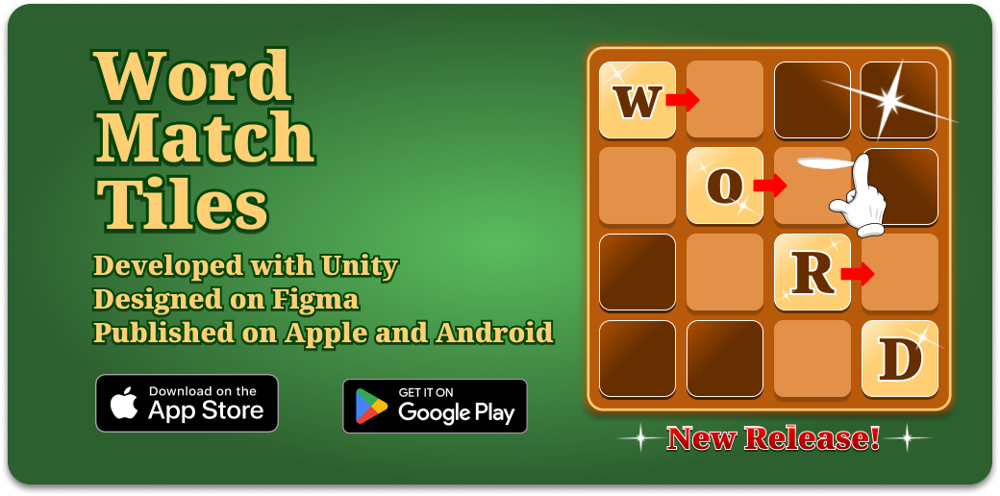

# Word Match Tiles

## 🛠️ **Technologies Used**

- **Unity Gaming Services**: Auth, IAP (In-App Purchases), CloudSave, Economy
- **Firebase**: Real-time Database and Backend services
- **Google Analytics**: For user interaction and engagement tracking
- **Facebook SDK**: For social login and interaction
- **IronSource SDK**: For ad mediation and monetization
- **Figma**: Used for UI/UX design and wireframes
- **IronSource Mediation**: For managing ad networks and maximizing revenue
- **Google Play Authentication**: Android user authentication
- **Apple Game Center Authentication**: iOS user authentication
- **GitHub LFS**: Large File Storage for handling game assets
- **GitHub CoPilot**: Assisted in code completion and AI-driven development
- **DoTween**: For smooth animations and transitions
- **Particle Systems**: For dynamic and engaging visual effects

## 📲 **Download Word Match Tiles**

- **[Download for Android](https://play.google.com/store/apps/dev?id=5076857182402717618)**
- **[Download for iOS](https://apps.apple.com/us/developer/cole-robinson/id1703674983)**
